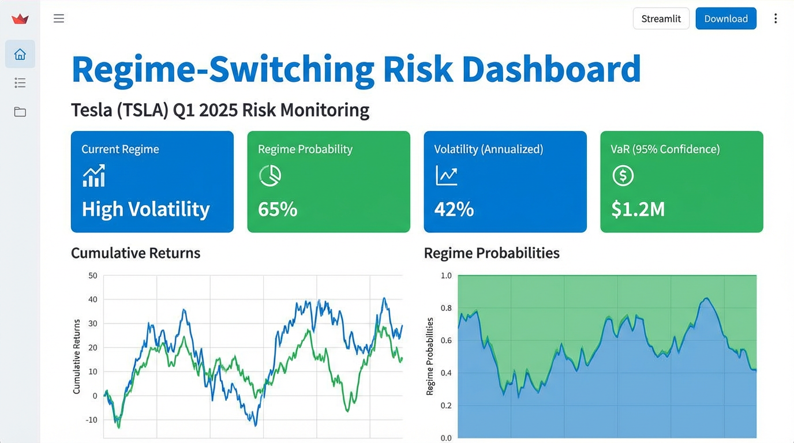

## Improving Risk Management with Regime-Switching Models

**Case Study: Tesla (TSLA) in Q1 2025**

This repository turns a Q1 2025 Tesla risk study into a small product: a reproducible modelling pipeline plus a Streamlit dashboard for regime detection, VaR, and risk recommendations.

### Dashboard Preview



### Features

- **Regime-switching volatility**: Fits a Markov regime-switching model (HMM-based) to TSLA returns.
- **Baseline vs advanced models**: Compares standard GARCH volatility to regime-switching volatility.
- **Risk metrics**: Computes daily VaR and counts VaR violations in Q1 2025.
- **Backtesting**: Applies Kupiec and Christoffersen tests to evaluate VaR performance.
- **Interactive dashboard**: Streamlit app showing current regime, regime probability, VaR, and a simple risk recommendation.

### Project Structure

- `TeslalokanaShankara.ipynb` – original research notebook.
- `TESLALOKANASHANKARAREPORTNEW.pdf` – written report.
- `TeslaLokanaShankara.pptx` – presentation slides.
- `data_loader.py` – fetches and caches TSLA price data.
- `models.py` – baseline GARCH and Markov regime-switching models.
- `risk.py` – VaR computation and backtesting (Kupiec and Christoffersen tests).
- `pipeline.py` – end-to-end TSLA Q1 2025 pipeline; writes outputs for the dashboard.
- `app.py` – Streamlit dashboard for visualization and decision support.
- `requirements.txt` – Python dependencies.
- `ENVIRONMENT_SETUP.md` – instructions to recreate the environment.

### How to Run Locally

1. **Create and activate a virtual environment** (see `ENVIRONMENT_SETUP.md` for details).
2. **Install dependencies**:

```bash
pip install -r requirements.txt
```

3. **Run the analysis pipeline** to generate outputs for Q1 2025:

```bash
python pipeline.py
```

4. **Launch the dashboard**:

```bash
streamlit run app.py
```

### Alignment with the Capstone Brief

- **Model**: Uses a baseline GARCH and a regime-switching (HMM-based) volatility model.
- **Focus**: TSLA risk and volatility in **Q1 2025**, with an estimation window before 2025-01-01.
- **Risk Management**: Computes VaR, counts violations, and applies Kupiec/Christoffersen tests.
- **Productization**: Provides a live dashboard that reports current regime, VaR, and a simple risk recommendation for TSLA, suitable for a “live tool” style presentation.

